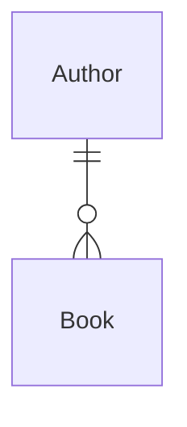

# One-to-many relation
> 5 minutes

The one-to-many relation is possibly the most frequently used relationship type. One row is referenced many times in
a different table.

We've already worked with this relationship in this workshop. The `Author` -> `Book` relation, where one `Author` has
many books, and the books table has a foreign key to the authors' table's id column.

```csharp
public class Author { // <- Principal
    public List<Book> Books { get; set; } = [];
}

public class Book { // <- Dependent
    public Author Author { get; set; }
}
```



## Task 1: Explicit Shadow property for a foreign key

We're using a GUID/UUID as the foreign key from books to authors. This might cause concerns for some developers and 
database administrators. We can overcome this by introducing a shadow property on the `Authors` table and use that as the
foreign key without changing our domain models.

1. Open the [ModelEntityConfigurations.cs](../../Shared/ModelEntityConfigurations.cs) file
2. Add a `long` shadow property to the `Author` called `"ObjectId"`.

<details>
<summary><b>Hint: Shadow property</b></summary>

```csharp
public class AuthorsConfiguration : IEntityTypeConfiguration<Author>
{
    public void Configure(EntityTypeBuilder<Author> builder)
    {
        // Other configuration omitted for brevity
        
        // New config
        builder.Property<long>("ObjectId").IsRequired().UseIdentityColumn();
        builder.HasIndex("ObjectId").IsUnique();
        
        builder.HasMany(a => a.Books)
            .WithOne(b => b.Author)
            // New config
            .HasPrincipalKey("ObjectId")
            .HasForeignKey("AuthorId")
            .IsRequired()
            .OnDelete(DeleteBehavior.Restrict);

    }
}
```
</details>

> Be aware that this is an unconventional configuration.

### [Go to one-to-one](02-one-to-one.md) 