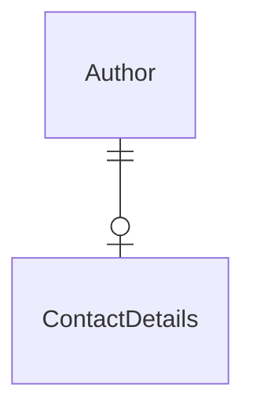

# One-to-one relation
> 5 minutes

Often times, a one-to-one design in databases is awkward because the two objects always go together, 
but they're split between two tables. In this case, you might want to simply merge the two tables.

Other times, it does make sense, typically when:
- The relation is temporal. The dependent side can live on its own but may only ever be related to one principal at a time.
- Merging the tables would result in many rows with null columns for the related data.

> Remember, in a one-to-one relation, the table with a foreign key is the dependent side.

However, one-to-one relations are widespread in application programming.

```csharp
public class Author { // <- Principal
    public ContactDetails? ContactDetails { get; set; }
}

public record ContactDetails(string Email); // <- Dependent
```



## Task 1: Add a one-to-one relation

Say we need to add contact details to the `Author`, and we'd like to model this as its own class with a separate table.

1. Open the [Models.cs](../../Shared/Models.cs) file
2. Add a new `ContactDetails` record type with a `Guid` Id and `string` "Email" property.
3. Add a `ContactDetails` nullable property to the `Author` class

<details>
<summary><b>Hint: One-to-one relation</b></summary>

```csharp
public record ContactDetails(Guid Id, string Email);

public class Author
{
    // New property to add
    public ContactDetails? ContactDetails { get; set; }
}
```
</details>

Create a new migration by running `dotnet ef migrations add AddContactDetails`. Remember to inspect the generated file.


## Task 2: Configure an owned type

Now, we don't want an additional table, but rather have the contact details in the same table as the `Author`. 
We can achieve this using "owned" types by adding additional configuration to our`AuthorConfiguration` 
in the [ModelEntityConfigurations.cs](../../Shared/ModelEntityConfigurations.cs) file.

1. Open the [ModelEntityConfigurations.cs](../../Shared/ModelEntityConfigurations.cs) file
2. Add a `ContactDetails` as an `Owned` type to the `Author` in the `AuthorsConfiguration` class.
3. Remove the `Id` property from the `ContactDetails` record in [Shared/Models.cs](../../Shared/Models.cs).

<details>
<summary><b>Hint: Owned type configuration</b></summary>

```csharp
// In ModelEntityConfigurations.cs
public class AuthorsConfiguration : IEntityTypeConfiguration<Author>
{
    public void Configure(EntityTypeBuilder<Author> builder)
    {
        // New configuration
        builder.OwnsOne(a => a.ContactDetails, contactsBuilder =>
        {
            contactsBuilder.Property(c => c.Email)
                .HasColumnName("Email")
                .HasMaxLength(320)
                .IsRequired();
        });
    }
}

// In Models.cs
public record ContactDetails(string Email);
```
</details>

Now try to generate a migration again using `dotnet ef migrations add AddContactDetails`.

### [Go to many-to-many](03-many-to-many.md)