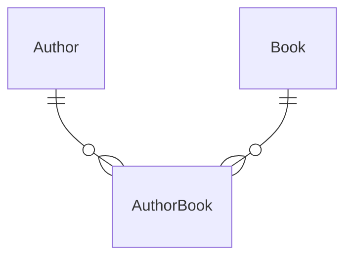

# Many-to-many relation
> 5 minutes

Before creating many-to-many relations, you should really take a close look at your needs and why you'd want to model
your domain this way.
Just like the one-to-one relationship, many-to-many are frequently awkward due to requiring an
intermediate "join" table that has two one-to-many relations.



## Task 1: Redesign the Author <––> Book relationship to many-to-many

Let's change the relationship between `Author` and `Book` so that one book may be written by many authors.

1. Open the [Shared/Models.cs](../../Shared/Models.cs) file
2. In the `Book` class, change the `Author` property to a `List<Author>`
3. Open the [Shared/ModelEntityConfigurations.cs](../../Shared/ModelEntityConfigurations.cs) file and reconfigure the
   relationship to many-to-many.

This approach is called "skip navigation," because your C# models are basically skipping the intermediate model
altogether.

<details>
<summary><b>Hint: Redesign to many-to-many relationship</b></summary>

```csharp
// Models.cs
public class Book
{
    public List<Author> Authors { get; private set; } = [];
}

// ModelEntityConfigurations.cs
public class AuthorsConfiguration : IEntityTypeConfiguration<Author>
{
    // Remove
    builder.HasMany(a => a.Books)
        .WithOne(b => b.Author)
        .HasPrincipalKey("ObjectId")
        .HasForeignKey("AuthorId")
        .IsRequired()
        .OnDelete(DeleteBehavior.Restrict);
    
    // Add
    builder.HasMany<Book>(a => a.Books)
        .WithMany(b => b.Authors)
        .UsingEntity("AuthorBook", abBuilder =>
        {
            abBuilder.HasOne(typeof(Author)).WithMany().HasForeignKey("AuthorsId").HasPrincipalKey("ObjectId");
        });
}

public class BooksConfiguration : IEntityTypeConfiguration<Book>
{
    // Remove
    builder.HasOne(b => b.Author)
         .WithMany(a => a.Books)
         .HasForeignKey("AuthorId");
}
```
</details>